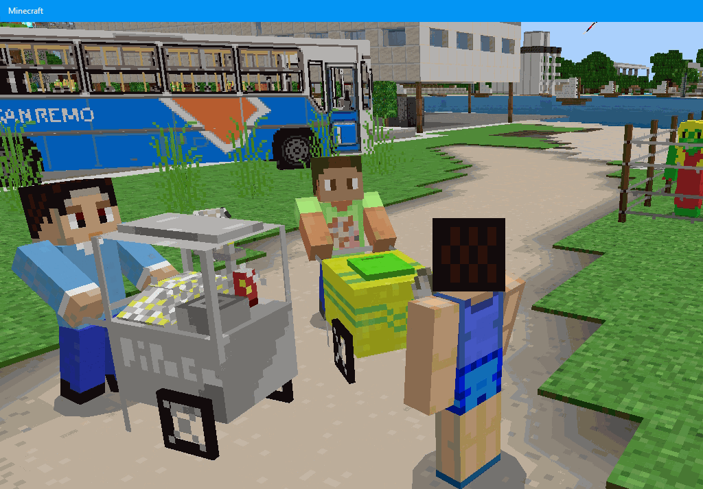
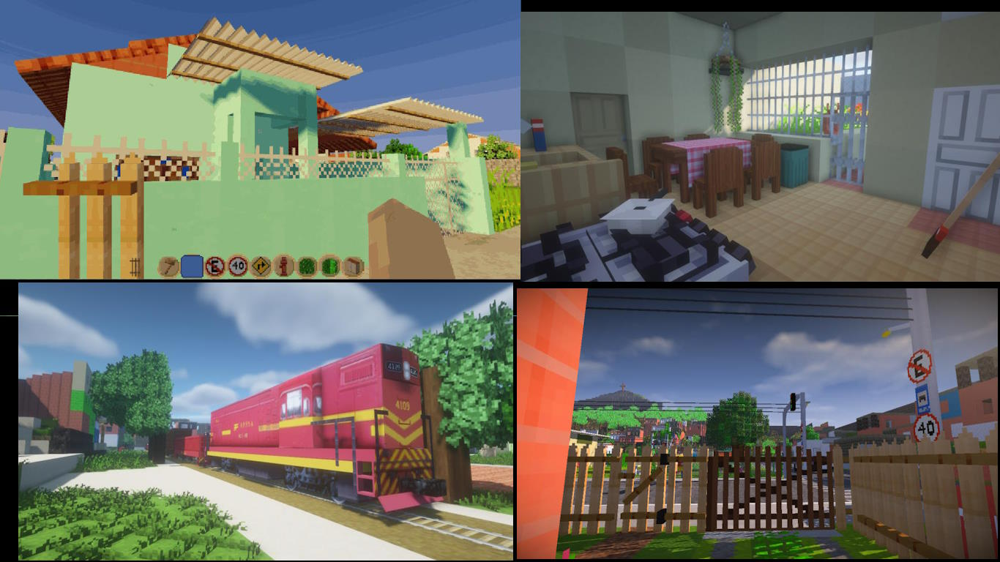
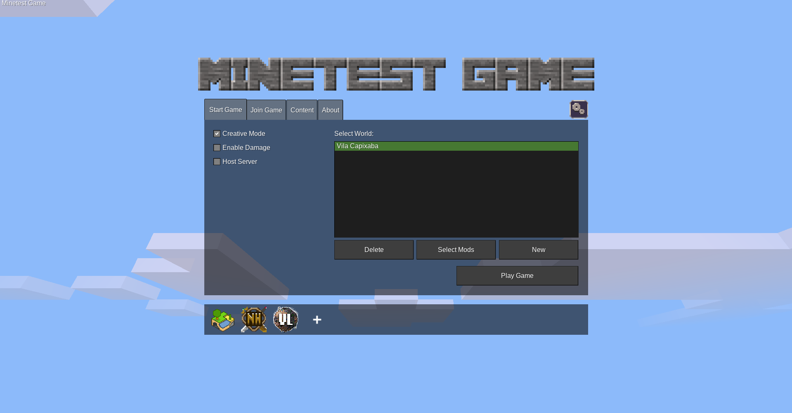

# Terras Capixabas
A Luanti Minetest mod made by Aloan, to represent Brazil and more specifically the Brazilian state of Espírito Santo.

  

## Meaning

"Terras Capixabas" means Capixabas' Lands, or to be more specific, Lands of the Capixaba people/place (in this case, all stuff and people from the state of Espirito Santo).
The word Capixaba has its origins in the indigenous word "kopi'xawa", from Tupi, which means land for plantation or where there is plantation, a 'countryside'.

*In Brazil, it is widely known as a gentilic for the people of Espirito Santo, but it is also the name of a city in the Brazilian state of Acre.

## The Game
This Minetest Game mod is a simulation of vacation and fun in a big village! A tropical paradise to enjoy a digital holiday with tours, interactions and entertainment. You can also opt for peace and tranquility, enjoying the landscape and taking photos. Transform your Luanti world into a place in Southeast Brazil with hundreds of models native to this region.

This mod is divided into two contents, the main mod "Terras_Capixabas" and "Vila_Capixaba" (Capixaba's Village) as the created world.

- Terras Capixabas
  - Vehicles: Rural wilys, Fiat 147, Brasilia, Chevette, Chevrolet Caravan, Landau, Opala, políce car, Mercedes 608D truck, articulated bucket truck 1113, Scania 111 truck, Honda CB400 motorcycle, Kombi, bulldozer, flying saucer...
  - Foods: Banana, coconut, pineaple, grape, orange, carambola (star fruit), beans, rice, milk, cod pie, pizza, cake, fried egg, french fries, popcorn, coxinha ('little drumstick' chicken croquette), nuggets, popsicle, sugarcane juice, cotton candy, hamburguer, coke, fanta...
  - Plants (and plant like): Palm tree, banana tree, chestnut tree, sugarcane, willow, vinca, agave, cattail, hibiscus, fern, seaweeds...
  - Animals: Dog, cat, bear, mouse, frog, seagull, crab, woodpecker, sparrow, butterfly, hummingbird, columbina dove, great kiskadee...
  - Objects: Atari (and pitfall), TVs, chairs, tables, sofas, freezer, shower, oven, radio, flags...

  - NPCs:
    - Folklore: Cuca, curupira, saci...
    - National Figures: Mônica, Cebolinha, Cascão, Magali, Tiririca, DR. Enéas, Monark, Bolsonaro, Lula, Ciro Gomes...
    - International Figures: Chun-Li, Ryu, Smurf, Smurfette, Taz, Nemo fish, Dory fish, Scooby, Wonder Woman...
    - Latino Figures: Don Ramón...
   
- Vila Capixaba
  - Streets, houses, store, rail... 

  

## How to Start

To play you need:

- [Luanti](https://www.luanti.org/) a [open source application](https://github.com/luanti-org/luanti). so you must first [install Luanti](https://www.luanti.org/en/downloads/) for PC (Windows / Linux) or mobile [Play Story](https://play.google.com/store/apps/details?id=net.minetest.minetest) and [Fdroid](https://f-droid.org/packages/net.minetest.minetest/) (only available for Android).

- On Luanti, click on '+', 'Games' and download the default game 'Minetest Game'.

- Download the folders from this repository and in the general '.minetest' folder created by Luanti, move the 'Vila_Capixaba' folder into the 'worlds' folder and 'terras_capixabas' into the 'mods' folder.

- Open Luanti (if it was open before placing the folders, close and reopen it to update) and in Minetest Game play the world 'Vila Capixaba'.

*Attention: if you delete the Vila Capixaba world inside or outside of Luanti, you will have to repeat the process of placing the folder in worlds.
**Note: Avoid using creative mode if you don't want to easily destroy things in the world.

  

## Useful settings, shortcuts and commands on PC

- Settings button (menu) or Esc (inside world) - Select your language or even linguistic variant (e.g. 'Brazilian Portuguese')

- W, A, S, D - Move
- Leftclick - Punck (and take, for some stuff)
- Rightclick - Place (and drive some vehicles)
- Space - Jump (and get out vehicles or fly with fly mode on)
- 1 to 8 or roll mouse wheel - Change selected hotbar slot

- I - Inventory
- Q - Drop item
- J - Fast move
- K - Fly mode
- H - Noclip mode (Pass-through like a ghost)
- C - Change point of view (1st person, 3rd person back, 3rd person froint)
- Z - See further

- f5 - Identify some itens and your location

- T - Open chat
  - To quickly change the time, type '/time 10000' for daytime and '/time 24000' for nighttime
  - To go back to the village if you are lost '/killme'
  - To Teleport, type '/teleport x y z' ('x', 'y' and 'z' must be positive or negative numbers, for north/south, altitude and east/west)
  - To mark a respawn point to return (do this on a bed or some other point in the village so you don't get permanently lost, /killme won't work to return): press F5, get the coordinates, and enter them in place of x, y, and z in '/sethome x y z' and return with /home

## Oficial Links
- Website: https://aloan.neocities.org/luanti
- Owner Repo: https://github.com/aloanmo-blip/TerrasCapixabas
- Mod Discord: https://discord.gg/e4pvVJtEmS
